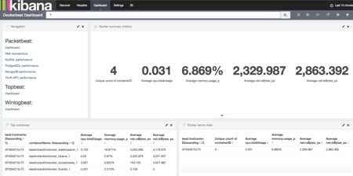
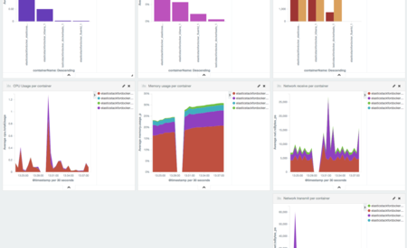

# Elastic stack for docker

Run the basic Elastic stack (Elasticsearch, Kibana, Fluentd) with Docker and Docker-compose.  
Kibana presets Beats dashboards :)

**Based on the official images:**
* [elasticsearch][1]
* [kibana][2]
* [Fluentd][5]
* [Dockerbeat][6]

## Snapshot of Dockerbeats Dashboard




## Requirements

### Setup
1. Install [Docker][3]
1. Install [Docker-compose][4]
1. Clone this repository.

### Usage
1. Start Elastic stack in background.
```bash
$ docker-compose up -d
```
2. Access to kibana.
```
http://localhost:5601/app/kibana#/dashboard
```

> Other beats packages are [here][7].

[1]: https://registry.hub.docker.com/_/elasticsearch/
[2]: https://registry.hub.docker.com/_/kibana/
[3]: http://docker.io/
[4]: http://docs.docker.com/compose/install/
[5]: https://hub.docker.com/r/fluent/fluentd/
[6]: https://hub.docker.com/r/ingensi/dockerbeat/~/dockerfile/
[7]: https://www.elastic.co/downloads/beats
